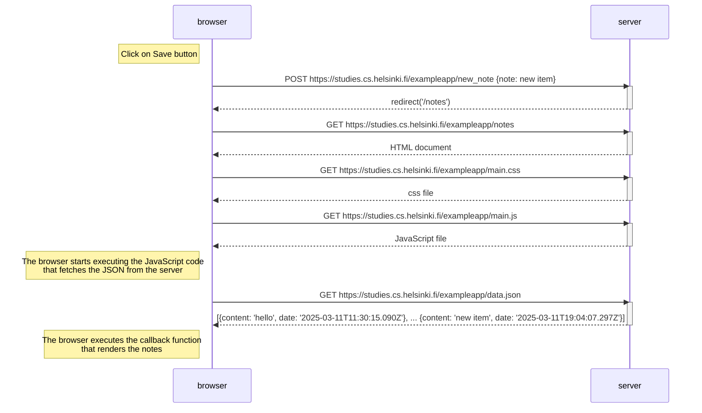

```mermaid
sequenceDiagram
    participant browser
    participant server

    Note left of browser: Click on Save button
    browser->>server: POST https://studies.cs.helsinki.fi/exampleapp/new_note {note: new item}
    activate server
    server-->>browser: redirect('/notes')
    deactivate server

    browser->>server: GET https://studies.cs.helsinki.fi/exampleapp/notes
    activate server
    server-->>browser: HTML document
    deactivate server

    browser->>server: GET https://studies.cs.helsinki.fi/exampleapp/main.css
    activate server
    server-->>browser: css file
    deactivate server

    browser->>server: GET https://studies.cs.helsinki.fi/exampleapp/main.js
    activate server
    server-->>browser: JavaScript file
    deactivate server

    Note left of browser: The browser starts executing the JavaScript code<br/>that fetches the JSON from the server

    browser->>server: GET https://studies.cs.helsinki.fi/exampleapp/data.json
    activate server
    server-->>browser: [{content: 'hello', date: '2025-03-11T11:30:15.090Z'}, ... {content: 'new item', date: '2025-03-11T19:04:07.297Z'}]
    deactivate server

    Note left of browser: The browser executes the callback function<br/>that renders the notes
    
```
