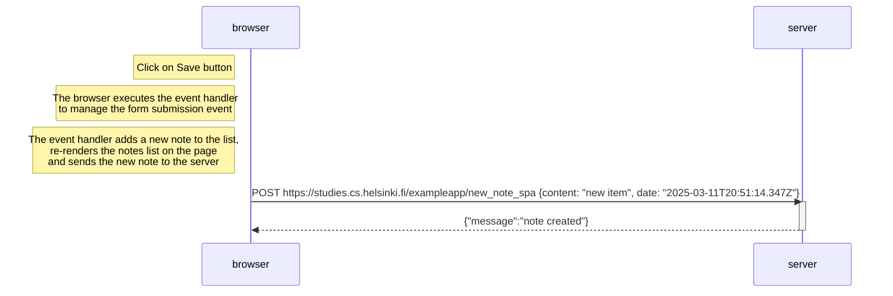

```mermaid
sequenceDiagram
    participant browser
    participant server

    Note left of browser: Click on Save button
    Note left of browser: The browser executes the event handler<br/>to manage the form submission event
    Note left of browser: The event handler adds a new note to the list,<br/>re-renders the notes list on the page<br/>and sends the new note to the server

    browser->>server: POST https://studies.cs.helsinki.fi/exampleapp/new_note_spa {content: "new item", date: "2025-03-11T20:51:14.347Z"}
    activate server
    server-->>browser: {"message":"note created"}
    deactivate server

```
